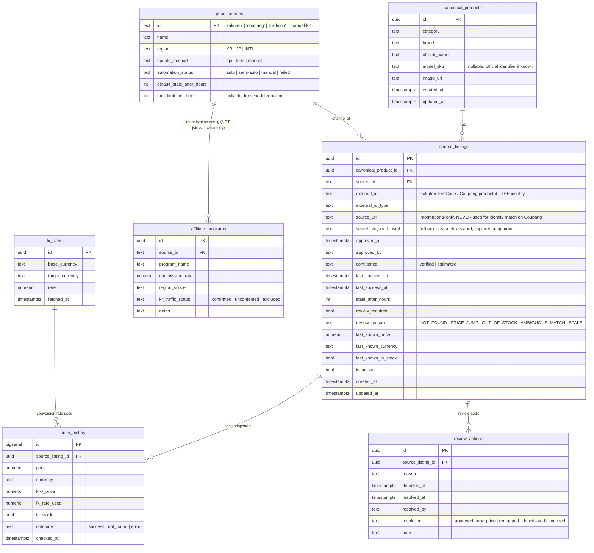
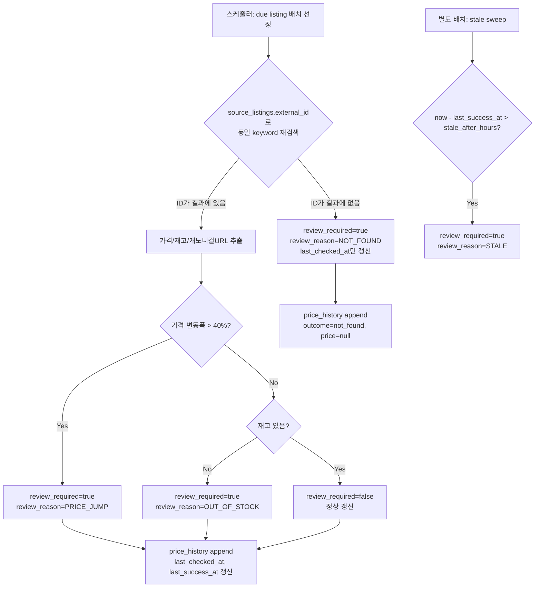
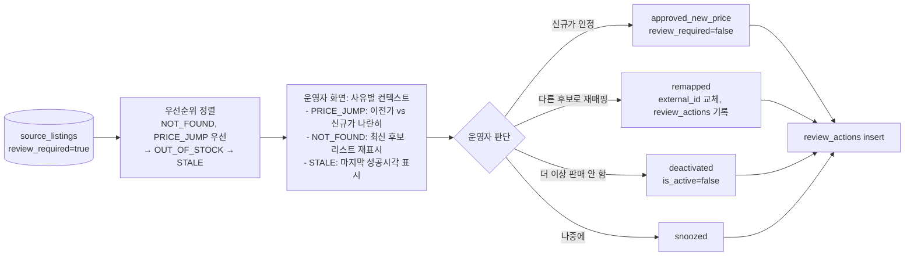
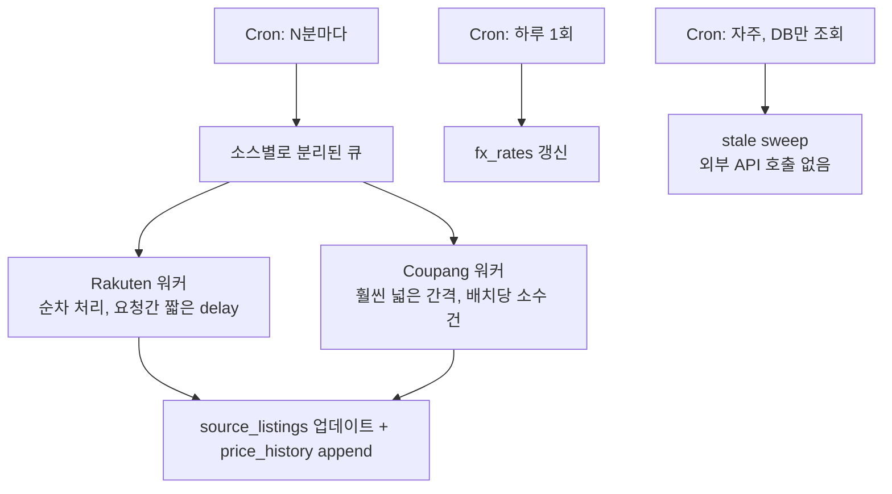

# Phase 1 — DB/API 설계

작성일: 2026-08-16. Phase 0/0.5 PoC(Rakuten, Coupang Partners, 반복 갱신 구조) 통과 후 작성.
**이 문서는 설계안이다. 승인 전까지 Supabase migration, 정식 웹 UI 구현을 시작하지 않는다.**

---

## 0. PoC에서 반드시 반영해야 하는 확정 사실

- Rakuten/Coupang 모두 **exact-lookup-by-id API가 없다** (Rakuten `itemCode` 파라미터 거부 확인, Coupang은 검색 API만 존재). → 갱신은 "동일 keyword 재검색 + ID 동등비교" 방식으로만 가능.
- **Rakuten의 핵심 external identifier는 `itemCode`**, **Coupang은 `productId`**.
- **Coupang의 `productUrl`은 식별 기준으로 쓸 수 없다** — 실제로 모든 상품이 `/re/AFFSDP`라는 동일한 리다이렉트 경로를 쓰고, 진짜 식별정보는 추적용 쿼리파라미터 안에 있어서 canonical화(쿼리 제거)하면 서로 다른 상품이 같은 값이 된다.
- 신규 상품의 **이름 기반 완전자동 매칭은 채택하지 않는다** — 최초 1회는 사람이 후보를 보고 승인하는 반자동 구조가 기본.
- fallback 재검색에서 기존 `externalId`를 못 찾으면 **절대 다른 상품으로 자동 대체하지 않는다** — `review_required=true`로만 넘긴다 (PoC의 synthetic NOT_FOUND 테스트로 확인).
- 가격 급변(40% 임계치), 품절, 미발견(NOT_FOUND), 장기 미갱신(stale) 전부 review 대상으로 자동 분류 가능함을 PoC로 확인.
- 두 소스 다 요청 빈도 제한이 있다 (Rakuten 버스트 시 429 확인·재시도 구현, Coupang 문서상 시간당 10회 수준 보고 다수) → 배치는 순차·저속으로 설계해야 한다.
- 카테고리는 다이빙에 한정되지 않는다 — 뷰티/패션/전자/생활용품에서도 동일 엔진이 실제로 작동함을 10개 상품(다이빙5+대중5)으로 확인. 스키마에 카테고리별 전용 컬럼을 두지 않는다.

---

## 1. ERD



핵심 설계 결정: **`canonical_products`와 `source_listings`은 완전히 분리**된다. 하나의 canonical product(예: "Garmin Descent Mk3s 010-02857-02")에 여러 source_listing(Rakuten/mic21, Coupang, 향후 TradeInn, 수동입력 한국몰...)이 N:1로 붙는다. `affiliate_programs`는 `price_sources`에만 연결되고 **`source_listings`나 가격비교 계산에는 절대 조인되지 않는다** — 수수료율이 순위에 영향을 주지 않도록 하는 구조적 강제.

---

## 2. 테이블 정의 (DDL 초안 — 아직 실행 안 함)

```sql
create table canonical_products (
  id uuid primary key default gen_random_uuid(),
  category text not null,              -- free text, e.g. 'diving' | 'beauty' | 'fashion' ... (카테고리 전용 컬럼 없음)
  brand text not null,
  official_name text not null,
  model_sku text,                      -- 공식 식별자 있으면 채움 (없어도 됨 - PoC에서 Suunto D5 등 미확정 사례 확인)
  image_url text,
  created_at timestamptz not null default now(),
  updated_at timestamptz not null default now()
);

create table price_sources (
  id text primary key,                 -- 'rakuten', 'coupang', 'tradeinn', 'manual-kr', ...
  name text not null,
  region text not null check (region in ('KR','JP','INTL')),
  update_method text not null check (update_method in ('api','feed','manual')),
  automation_status text not null check (automation_status in ('auto','semi-auto','manual','failed')),
  default_stale_after_hours int not null default 24,
  rate_limit_per_hour int
);

create table source_listings (
  id uuid primary key default gen_random_uuid(),
  canonical_product_id uuid not null references canonical_products(id) on delete cascade,
  source_id text not null references price_sources(id),
  external_id text not null,
  external_id_type text not null,      -- 'rakuten_item_code' | 'coupang_product_id' | ...
  source_url text,                     -- Coupang: 표시용일 뿐, 식별에 사용 금지 (주석/앱레벨 강제)
  search_keyword_used text not null,
  approved_at timestamptz not null default now(),
  approved_by text not null,
  confidence text not null check (confidence in ('verified','estimated')),
  last_checked_at timestamptz,
  last_success_at timestamptz,
  stale_after_hours int not null default 24,
  review_required boolean not null default false,
  review_reason text check (review_reason in ('NOT_FOUND','PRICE_JUMP','OUT_OF_STOCK','AMBIGUOUS_MATCH','STALE')),
  last_known_price numeric,
  last_known_currency text,
  last_known_in_stock boolean,
  is_active boolean not null default true,
  created_at timestamptz not null default now(),
  updated_at timestamptz not null default now(),

  -- 하나의 (소스, external_id)는 정확히 하나의 canonical product에만 매핑된다
  unique (source_id, external_id)
);

create index idx_source_listings_product on source_listings (canonical_product_id) where is_active;
create index idx_source_listings_review_queue on source_listings (review_required, updated_at) where review_required and is_active;
create index idx_source_listings_due_refresh on source_listings (source_id, last_checked_at nulls first) where is_active;

create table price_history (
  id bigserial primary key,
  source_listing_id uuid not null references source_listings(id) on delete cascade,
  price numeric,
  currency text,
  krw_price numeric,
  fx_rate_used numeric,
  in_stock boolean,
  outcome text not null check (outcome in ('success','not_found','error')),
  checked_at timestamptz not null default now()
);

create index idx_price_history_listing_time on price_history (source_listing_id, checked_at desc);

create table fx_rates (
  id uuid primary key default gen_random_uuid(),
  base_currency text not null,
  target_currency text not null,
  rate numeric not null,
  fetched_at timestamptz not null default now(),
  unique (base_currency, target_currency, fetched_at)
);

create table affiliate_programs (
  id uuid primary key default gen_random_uuid(),
  source_id text not null references price_sources(id),
  program_name text not null,
  commission_rate numeric,
  region_scope text,
  kr_traffic_status text not null check (kr_traffic_status in ('confirmed','unconfirmed','excluded')),
  notes text
);
-- 이 테이블은 가격비교/랭킹 쿼리에서 절대 JOIN하지 않는다. 미디어킷·리포트 용도 전용.

create table review_actions (
  id uuid primary key default gen_random_uuid(),
  source_listing_id uuid not null references source_listings(id) on delete cascade,
  reason text not null,
  detected_at timestamptz not null,
  resolved_at timestamptz,
  resolved_by text,
  resolution text check (resolution in ('approved_new_price','remapped','deactivated','snoozed')),
  note text
);
```

**제약조건 설계 의도**
- `unique (source_id, external_id)` — 같은 소스의 같은 상품이 두 canonical product에 잘못 매핑되는 걸 DB 레벨에서 차단.
- `source_listings`엔 `canonical_product_id + source_id` unique 제약을 **걸지 않음** — 같은 소스에 동일 canonical product를 파는 판매자가 여럿일 수 있음(예: Rakuten 내 mic21 vs 다른 다이빙샵).
- `price_history`는 append-only, `source_listings.last_known_*`는 최신값 캐시(비정규화) — 상품 상세 페이지는 `source_listings`만 읽으면 되고, 이력 그래프가 필요할 때만 `price_history` 조회.
- `review_reason`을 enum으로 고정해 review queue 필터링/우선순위 로직이 문자열 파싱 없이 동작하게 함.

---

## 3. 가격 갱신 흐름



핵심 규칙(PoC `src/refresh.ts` 그대로 계승):
- **찾았을 때만 `last_success_at` 갱신.** 못 찾아도 `last_checked_at`은 항상 갱신 — "언제 마지막으로 시도했는지"와 "언제 마지막으로 성공했는지"를 분리해야 stale 판정이 정확함.
- `confidence`는 갱신 과정에서 **절대 자동으로 바뀌지 않는다** — 최초 승인 시 사람이 정한 값을 유지. `review_required`만 매 사이클 재계산.
- Coupang은 URL 비교 단계를 건너뛴다(위 0번 항목 이유) — `external_id`(productId) 존재 여부와 가격만으로 판단.

---

## 4. 신규 상품 승인 흐름 (반자동)

```mermaid
flowchart TD
    A[운영자: canonical_product 선택 + 소스 지정] --> B[해당 소스 어댑터로 keyword 검색\n(rakuten.ts / coupang.ts 그대로 재사용)]
    B --> C[후보 리스트 원본 그대로 화면 표시\n상품명/가격/이미지/URL/재고]
    C --> D{운영자가 정확한 후보를\n직접 선택}
    D -->|선택함| E[source_listings row 생성\nexternal_id = 선택한 후보의 id\nsearch_keyword_used = 이번 검색어\napproved_by = 운영자]
    D -->|없음/불확실| F[승인 보류\n(row 생성 안 함 = 이 leg은 데이터 없음)]
    E --> G{공식 SKU가 후보 상품명에\n포함되어 있었는가?}
    G -->|Yes| H[confidence = verified]
    G -->|No| I[confidence = estimated]
```

- 이름 기반 완전자동 확정 단계가 **아예 존재하지 않는다** — 검색은 "후보를 보여주는 것"까지만 하고, 최종 선택은 항상 사람.
- `confidence` 산정 로직(공식 SKU 포함 여부로 verified/estimated 구분)은 PoC의 다이빙 5개 + 대중 5개 배치에서 쓴 기준을 그대로 승격.
- 승인 시점의 `search_keyword_used`가 이후 모든 갱신 fallback 검색에 재사용되므로, 이 키워드 선택 자체가 운영자 UX에서 중요한 입력값이 됨(향후 UI 설계 시 고려사항으로 남김, 지금 안 만듦).

---

## 5. Review Queue 흐름



Review queue는 별도 테이블이 아니라 `source_listings WHERE review_required = true AND is_active` 쿼리 + `idx_source_listings_review_queue` 인덱스로 처리. 액션 이력만 `review_actions`에 남긴다 — "검수 필요 N건"만 보여주고 나머지는 숨기는 기획 문서의 원래 요구사항과 일치.

---

## 6. 가격비교 계산 (엔진 — 별도 저장 테이블 없음, 조회시 계산)

입력: `canonical_product_id` → 활성 `source_listings` 전체(`is_active=true`, 가격 존재) → `price_sources.region`별로 KRW 환산(`fx_rates` 최신값) → 가격 오름차순 정렬.

```
legs = active source_listings with last_known_price is not null
count(legs):
  0 → "가격 정보 없음"
  1 → "비교 불가, 단일가만 표시" (+ 어느 지역인지 명시)
  2 → "2-way 비교" (winner, diff, diff%)
  3+ → "N-way 비교" (winner, 나머지는 winner 대비 diff)
```

**절대 규칙**: 이 계산 쿼리는 `affiliate_programs`, `commission_rate` 어떤 컬럼도 참조하지 않는다. 어느 소스가 제휴 가능한지는 화면 표시(배지/문구) 레이어에서만 별도로 붙이고, 정렬·winner 판정 로직과는 코드 경로 자체를 분리한다.

---

## 7. API Endpoint 초안 (미구현)

| Method | Path | 용도 |
|---|---|---|
| GET | `/api/products/:id` | canonical product + 활성 source_listings + 계산된 winner/diff |
| GET | `/api/products/:id/price-history` | `price_history` 시계열 (source_listing_id 필터 가능) |
| GET | `/api/admin/review-queue` | `review_required=true` 목록, 사유별 정렬 |
| POST | `/api/admin/source-listings` | 신규 상품 승인 (5번 흐름의 결과 저장) |
| PATCH | `/api/admin/source-listings/:id` | review 액션 처리 (승인/재매핑/비활성화/보류) |
| POST | `/api/admin/source-listings/:id/refresh` | 수동 즉시 갱신 트리거 |
| POST | `/internal/jobs/refresh-batch` | 스케줄러 전용, 배치 갱신 실행 |
| POST | `/internal/jobs/stale-sweep` | 스케줄러 전용, stale 판정만 (외부 호출 없음) |
| POST | `/internal/jobs/refresh-fx-rates` | 환율 갱신 |

admin/internal 엔드포인트의 인증은 이번 범위 밖(로그인 시스템 미구현) — 지금은 설계상 구분만 해둔다.

---

## 8. 배치/스케줄러 구조

PoC로 확인된 두 소스의 호출 제약이 스케줄러 설계를 직접 결정한다.

- **Rakuten**: 순간적으로 몰리면 429(재시도 로직 이미 구현·검증됨) — 소스 내에서는 순차 처리 + 짧은 간격이면 충분.
- **Coupang**: 여러 커뮤니티 자료에서 시간당 10회 수준으로 보고됨(공식 수치 아님, 참고치) — 훨씬 더 보수적인 페이싱 필요.



우선순위 규칙:
- `last_checked_at`이 오래된 것부터 (`nulls first`) 우선 처리.
- `review_reason=NOT_FOUND`인 항목은 사람이 해결하기 전까지 **일반 주기보다 훨씬 느리게**(예: 1일 1회) 재시도 — 이미 문제로 표시된 항목에 제한된 API 쿼터를 계속 쓰지 않기 위함.
- 소스별 워커를 분리해서 한쪽 소스의 rate limit이 다른 쪽 갱신을 막지 않게 함.

---

## 9. PoC 코드 재사용 매핑

| PoC 파일 | Phase 1에서의 역할 |
|---|---|
| `src/types.ts` | DB 스키마 필드명/enum의 원형. `ApprovedSourceMapping` → `source_listings` 테이블로 거의 그대로 승격 |
| `src/sources/rakuten.ts` | Rakuten 어댑터로 **거의 그대로 재사용**. 서버 환경변수 연결만 다시 배선 |
| `src/sources/coupang.ts` | Coupang 어댑터로 **거의 그대로 재사용** (HMAC 서명 로직 포함) |
| `src/match.ts` (`pickItemBySku`, `pickItemByTerms`, `normalize`) | (a) 신규 승인 흐름의 "후보 하이라이트"용, (b) 갱신 흐름의 ID 재식별용 — 이미 두 용도로 설계돼 있어 그대로 재사용 |
| `src/refresh.ts` (`refreshRakutenMapping/CoupangMapping`) | 스케줄러 워커의 핵심 로직. **JSON 파일 I/O만 DB I/O로 교체**하면 됨 — 판정 로직(`decideReview`, 40% 임계치, URL 비교 제외 등)은 이미 검증됐으므로 변경 없음 |
| `src/store.ts` | **재사용 안 함** — Supabase/Postgres 레이어로 교체. 다만 저장 스키마(JSON shape)는 위 테이블 정의의 기반이 됨 |
| `src/exchangeRate.ts` | `fx_rates` 갱신 잡으로 거의 그대로 재사용 |
| `src/products.ts`, `src/mainstreamBatch1.ts` | 프로덕션 코드 아님 — **초기 시드 데이터 참고자료**로만 사용(이미 실제 API로 검증된 10개 상품이므로 최초 canonical_products/source_listings 시드에 활용 가능) |
| `verify-rakuten*.ts`, `verify-coupang.ts` | 신규 상품 승인 화면(5번 흐름)의 "후보 검색" 백엔드 로직 프로토타입 |
| `bootstrap-mappings.ts` / `refresh-mappings.ts` | 각각 승인 API(POST `/api/admin/source-listings`)와 배치 워커(`/internal/jobs/refresh-batch`)의 원형 |

---

## 10. 카테고리 무관성 체크리스트 (요구사항 재확인)

- [x] `canonical_products.category`는 자유 텍스트 — 다이빙 전용 컬럼 없음
- [x] `source_listings`/`price_history`/`review_actions` 전부 카테고리 참조 없음 — 어떤 카테고리든 동일 테이블·동일 로직
- [x] 매칭 엔진(`match.ts`)은 이미 다이빙 5개 + 대중 5개(뷰티/패션/전자/생활용품)로 카테고리 무관 동작 실증됨
- [x] 소스 어댑터(rakuten.ts/coupang.ts)도 카테고리 파라미터 없이 keyword만 받음

---

승인해주시면 이 스키마 그대로 Supabase migration 파일 작성으로 넘어가겠습니다. 그전까지는 진행하지 않습니다.
